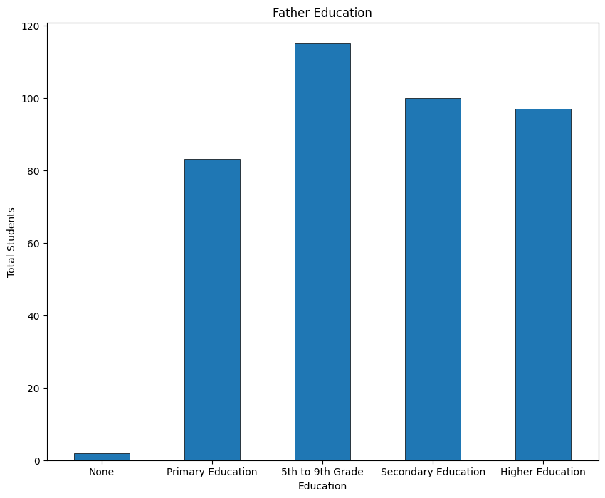

# Student Analyst Identifies Correlations That Affect the Final Grade
This project do Analyst about Student and find which high correlation factor that affect final grade to student.
Dataset source https://www.kaggle.com/datasets/whenamancodes/student-performance

# About Dataset
This data approach student achievement in secondary education of two Portuguese schools. The data attributes include student grades, demographic, social and school related features) and it was collected by using school reports and questionnaires. Two datasets are provided regarding the performance in two distinct subjects: Mathematics (mat) and Portuguese language (por). In [Cortez and Silva, 2008], the two datasets were modeled under binary/five-level classification and regression tasks. Important note: the target attribute G3 has a strong correlation with attributes G2 and G1. This occurs because G3 is the final year grade (issued at the 3rd period), while G1 and G2 correspond to the 1st and 2nd period grades. It is more difficult to predict G3 without G2 and G1, but such prediction is much more useful (see paper source for more details). **This Project only find for Mathematics**

| Column      | Description                                                                                                                                                    |
|-------------|----------------------------------------------------------------------------------------------------------------------------------------------------------------|
| `school`    | Student's school (binary: 'GP' - Gabriel Pereira or 'MS' - Mousinho da Silveira)                                                                               |
| `sex`       | Student's sex (binary: 'F' - female or 'M' - male)                                                                                                             |
| `age`       | Student's age (numeric: from 15 to 22)                                                                                                                         |
| `address`   | Student's home address type (binary: 'U' - urban or 'R' - rural)                                                                                               |
| `famsize`   | Family size (binary: 'LE3' - less or equal to 3 or 'GT3' - greater than 3)                                                                                     |
| `Pstatus`   | Parent's cohabitation status (binary: 'T' - living together or 'A' - apart)                                                                                    |
| `Medu`      | Mother's education (numeric: 0 - none, 1 - primary education (4th grade), 2 - 5th to 9th grade, 3 - secondary education, or 4 - higher education)              |
| `Fedu`      | Father's education (numeric: 0 - none, 1 - primary education (4th grade), 2 - 5th to 9th grade, 3 - secondary education, or 4 - higher education)              |
| `Mjob`      | Mother's job (nominal: 'teacher', 'health' care related, civil 'services' (e.g., administrative or police), 'at_home', or 'other')                            |
| `Fjob`      | Father's job (nominal: 'teacher', 'health' care related, civil 'services' (e.g., administrative or police), 'at_home', or 'other')                            |
| `reason`    | Reason to choose this school (nominal: close to 'home', school 'reputation', 'course' preference, or 'other')                                                 |
| `guardian`  | Student's guardian (nominal: 'mother', 'father', or 'other')                                                                                                   |
| `traveltime`| Home to school travel time (numeric: 1 - <15 min., 2 - 15 to 30 min., 3 - 30 min. to 1 hour, or 4 - >1 hour)                                                  |
| `studytime` | Weekly study time (numeric: 1 - <2 hours, 2 - 2 to 5 hours, 3 - 5 to 10 hours, or 4 - >10 hours)                                                              |
| `failures`  | Number of past class failures (numeric: n if 1<=n<3, else 4)                                                                                                   |
| `schoolsup` | Extra educational support (binary: yes or no)                                                                                                                  |
| `famsup`    | Family educational support (binary: yes or no)                                                                                                                 |
| `paid`      | Extra paid classes within the course subject (Math or Portuguese) (binary: yes or no)                                                                          |
| `activities`| Extra-curricular activities (binary: yes or no)                                                                                                                |
| `nursery`   | Attended nursery school (binary: yes or no)                                                                                                                    |
| `higher`    | Wants to take higher education (binary: yes or no)                                                                                                             |
| `internet`  | Internet access at home (binary: yes or no)                                                                                                                    |
| `romantic`  | In a romantic relationship (binary: yes or no)                                                                                                                 |
| `famrel`    | Quality of family relationships (numeric: from 1 - very bad to 5 - excellent)                                                                                  |
| `freetime`  | Free time after school (numeric: from 1 - very low to 5 - very high)                                                                                           |
| `goout`     | Going out with friends (numeric: from 1 - very low to 5 - very high)                                                                                           |
| `Dalc`      | Workday alcohol consumption (numeric: from 1 - very low to 5 - very high)                                                                                      |
| `Walc`      | Weekend alcohol consumption (numeric: from 1 - very low to 5 - very high)                                                                                      |
| `health`    | Current health status (numeric: from 1 - very bad to 5 - very good)                                                                                            |
| `absences`  | Number of school absences (numeric: from 0 to 93)                                                                                                              |

These grades are related with the course subject, Math :
| Grade | Description                                             |
|-------|---------------------------------------------------------|
| `G1`  | First period grade (numeric: from 0 to 20)              |
| `G2`  | Second period grade (numeric: from 0 to 20)             |
| `G3`  | Final grade (numeric: from 0 to 20, serves as the target output) |

# Exploratroy Data Analyst
Check Column
```python
df_student.columns
```
Index(['school', 'sex', 'age', 'address', 'famsize', 'Pstatus', 'Medu', 'Fedu',
       'Mjob', 'Fjob', 'reason', 'guardian', 'traveltime', 'studytime',
       'failures', 'schoolsup', 'famsup', 'paid', 'activities', 'nursery',
       'higher', 'internet', 'romantic', 'famrel', 'freetime', 'goout', 'Dalc',
       'Walc', 'health', 'absences', 'G1', 'G2', 'G3'],
      dtype='object')
# Check Null Data
```python
df_student.isnull().sum()
```

# Check Duplicate
```python
df_student.duplicated().sum()
```
 idx | school | sex | age | address | famsize | Pstatus | Medu | Fedu | Mjob   | Fjob    | ... | famrel | freetime | goout | Dalc | Walc | health | absences | G1 | G2 | G3 |
|-----|--------|-----|-----|---------|---------|---------|------|------|--------|---------|-----|--------|----------|-------|------|------|--------|----------|----|----|----|
| 395 | GP     | F   | 18  | U       | GT3     | A       | 4    | 4    | at_home | teacher | ... | 4      | 3        | 4     | 1    | 1    | 3      | 6        | 5  | 6  | 6  |
| 396 | MS     | M   | 19  | R       | GT3     | T       | 1    | 1    | other   | services| ... | 4      | 3        | 2     | 1    | 3    | 5      | 0        | 6  | 5  | 0  |

Duplicates data is eligimates, didn't need to handling

# Show Student that have 0 Final Grade
G1	first period grade (numeric: from 0 to 20)
G2	second period grade (numeric: from 0 to 20)
G3	final grade (numeric: from 0 to 20, output target)
```python
df_student_zero_g3 = df_student[df_student["G3"] == 0.0]
df_student_zero_g3
```

# Describe
```python
df_student.describe()
```
| Statistic | Age       | Medu      | Fedu      | Traveltime | Studytime | Failures | Famrel    | Freetime  | Goout     | Dalc      | Walc      | Health    | Absences  | G1        | G2        | G3        |
|-----------|-----------|-----------|-----------|------------|-----------|----------|-----------|-----------|-----------|-----------|-----------|-----------|-----------|-----------|-----------|-----------|
| Count     | 397.000   | 397.000   | 397.000   | 397.000    | 397.000   | 397.000  | 397.000   | 397.000   | 397.000   | 397.000   | 397.000   | 397.000   | 397.000   | 397.000   | 397.000   | 397.000   |
| Mean      | 16.705    | 2.748     | 2.521     | 1.451      | 2.033     | 0.335    | 3.945     | 3.234     | 3.108     | 1.479     | 2.290     | 3.557     | 5.695     | 10.882    | 10.688    | 10.378    |
| Std Dev   | 1.280     | 1.097     | 1.091     | 0.697      | 0.839     | 0.743    | 0.894     | 0.996     | 1.113     | 0.889     | 1.287     | 1.389     | 7.988     | 3.333     | 3.770     | 4.605     |
| Min       | 15.000    | 0.000     | 0.000     | 1.000      | 1.000     | 0.000    | 1.000     | 1.000     | 1.000     | 1.000     | 1.000     | 1.000     | 0.000     | 3.000     | 0.000     | 0.000     |
| 25%       | 16.000    | 2.000     | 2.000     | 1.000      | 1.000     | 0.000    | 4.000     | 3.000     | 2.000     | 1.000     | 1.000     | 3.000     | 0.000     | 8.000     | 9.000     | 8.000     |
| 50%       | 17.000    | 3.000     | 2.000     | 1.000      | 2.000     | 0.000    | 4.000     | 3.000     | 3.000     | 1.000     | 2.000     | 4.000     | 4.000     | 11.000    | 11.000    | 11.000    |
| 75%       | 18.000    | 4.000     | 3.000     | 2.000      | 2.000     | 0.000    | 5.000     | 4.000     | 4.000     | 2.000     | 3.000     | 5.000     | 8.000     | 13.000    | 13.000    | 14.000    |
| Max       | 22.000    | 4.000     | 4.000     | 4.000      | 4.000     | 3.000    | 5.000     | 5.000     | 5.000     | 5.000     | 5.000     | 5.000     | 75.000    | 19.000    | 19.000    | 20.000    |

# Gender Distribution


# Age Distribution


# Travel Time Distribution


# Study Time Distribution


# Free Time After School Distribution


# Go Out With Friends Distribution


# Absences Distribution


# Mother Education Distribution


# Father Education Distribution


# First Period Grade


# Second Period Grade


# Final Grade


# Find Variable Correlation and G3
In this case, Median is used to find correlation


# Correlation Coefficient and Heatmap


Heatmap


# Conclusion
In summary, prior grades (G1 and G2) are the most significant predictors of the final grade, while factors like parental education and study time contribute positively, though to a lesser extent. Past failures negatively affect final grades. Age, family relations, and social activities (like going out) have relatively minor correlations with G3. Although these factors do play a role in student life, they are less predictive of final academic outcomes compared to prior grades and study-related variables. The analysis concludes that academic consistency (G1 and G2), parental education, study habits, and minimal past failures are key factors influencing a student's final grade (G3).
